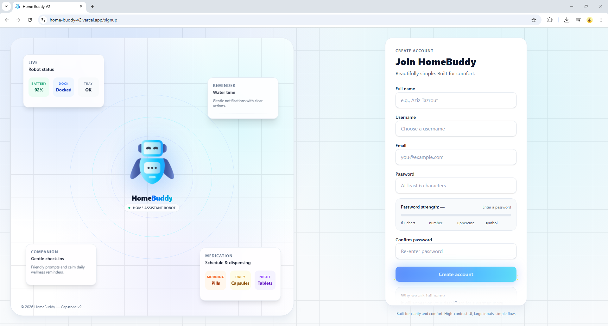
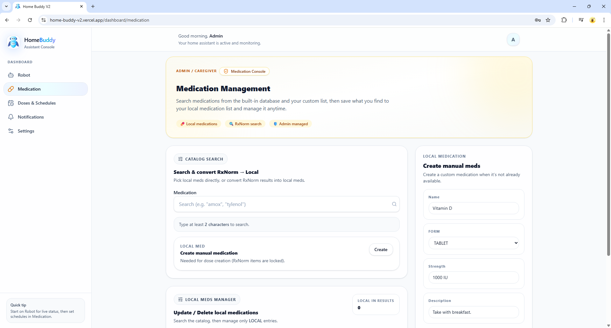
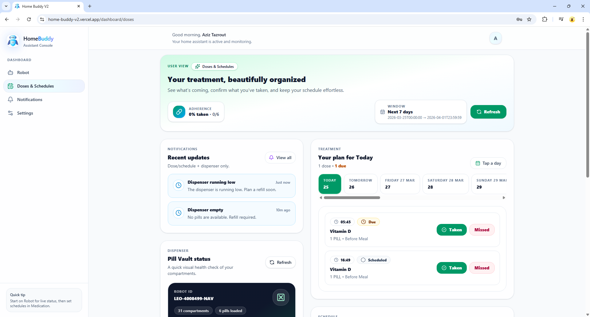
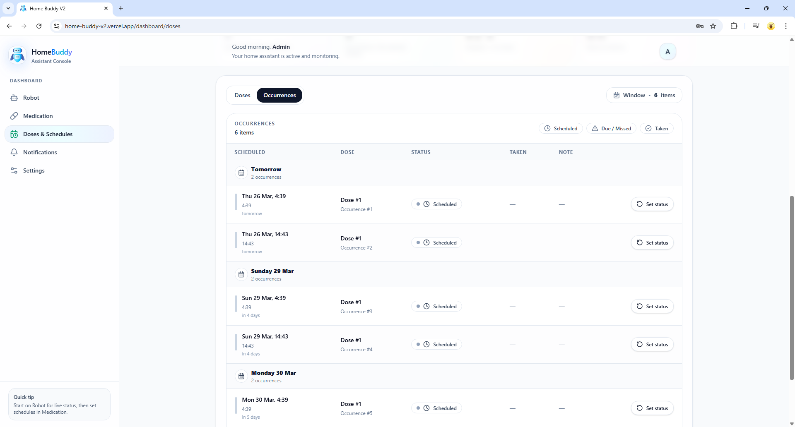
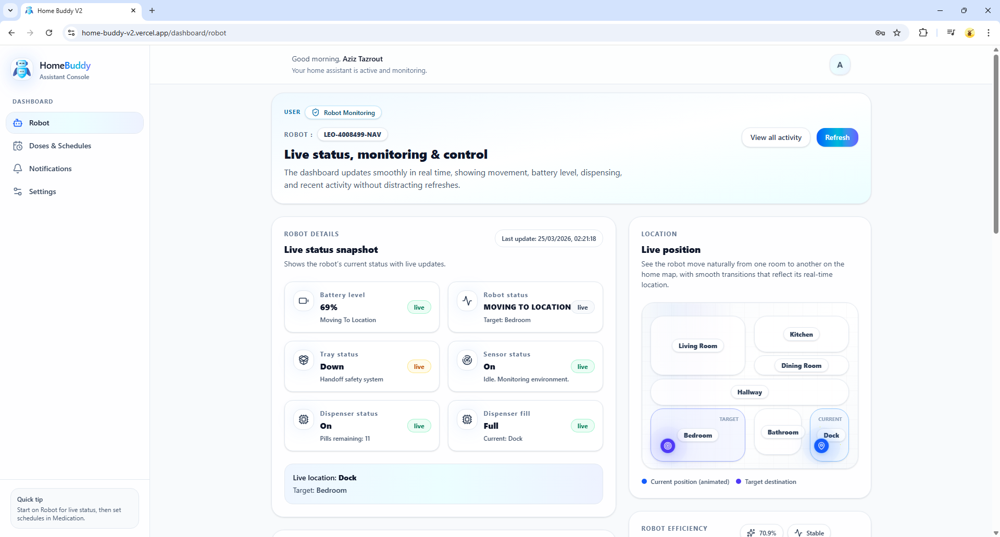
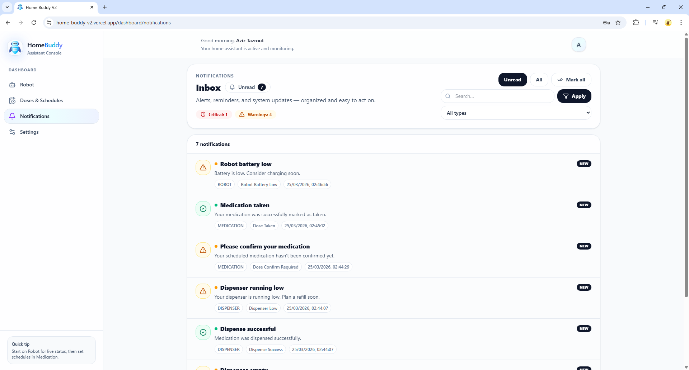

# 🤖 HomeBuddy — Frontend Application

A **production‑grade frontend application** for a home assistant robot platform, designed with **clarity, reliability, and human‑centric UX** at its core.

This repository focuses on the **frontend system** — the user interface layer that connects people to a real, live robotic and healthcare‑oriented platform.

The application is fully deployed and can be explored live.

🌐 **Live Demo:** https://home-buddy-v2.vercel.app/                                           
🧠 **Backend API:** https://github.com/azedta/home-buddy-v2

---

## 🌟 Frontend Vision

HomeBuddy’s frontend is designed around three real user contexts:

- 👵 **Elderly users** who need calm visuals, large touch targets, and confidence in every action  
- 👨‍⚕️ **Caregivers & administrators** who need visibility, control, and predictable workflows  
- 🤖 **A physical robot system**, where UI decisions must reflect real‑world behavior  

Every screen, component, and interaction is intentional and purpose‑driven.

---

## 🧠 Design Philosophy

- **Calm interfaces** → soft color palettes, low visual noise, stable layouts  
- **Predictable interactions** → consistent spacing, familiar patterns, no surprises  
- **Accessibility‑aware UI** → readable typography, forgiving interactions, clear feedback  
- **Human‑centered language** → friendly wording over technical jargon  

The goal is not visual flash — it is **clarity, trust, and usability**.

---

## 🧩 Major Frontend Modules

> Screenshots below demonstrate real application flows and interaction patterns.

### 🔐 Authentication (Login & Signup)
- Clean, reassuring authentication flows
- Real‑time validation with clear feedback
- Password strength guidance during signup
- Session‑aware and persistent login handling
- Calm success and error messaging

---

### 💊 Medication Management
A core part of the application’s frontend experience.

- Clear separation between **Elderly** and **Admin/Caregiver** views
- UI structured around real medication routines
- Emphasis on readability and reassurance
- Card‑based layouts designed to reduce cognitive load

---

### 🕒 Dose Scheduling & Daily Planning
- Day‑based planners instead of dense timelines
- Window‑based schedules for better comprehension
- Visual rhythm (morning / afternoon / night)
- Status changes that are deliberate and explicit

---

### 🤖 Robot & Dispenser Awareness
- Status cards designed to inform without alarming
- Clear indicators for battery, tray, docking, and dispenser state
- Visual metaphors instead of raw technical data
- Companion‑like presentation rather than machine‑centric UI

---

### 🔔 Notifications Center
A complete **frontend notification inbox**, not a simple alert system.

- Severity‑aware visuals (critical, warning, info, success)
- Clear, human‑friendly titles and messages
- Admin view across multiple users
- Filtering, pagination, and search
- Expandable details with optional technical transparency
  

---

## 🔗 Frontend & Backend Integration

This frontend is fully integrated with a live backend system:

- All UI actions reflect **real backend state**
- Authentication, medication schedules, notifications, and robot status are live
- Role‑aware rendering matches backend authorization logic
- UI state updates accurately reflect system events

The application is deployed end‑to‑end, allowing the entire system to be explored in real time.

---

## 🧱 Frontend Architecture Highlights

- Component‑driven UI design
- Predictable state management
- Role‑aware rendering within a single application
- Consistent visual language across all modules
- No placeholder or decorative UI — every component is functional

---

## 🏁 Summary

This frontend represents a complete, production‑ready user interface for a complex, real‑world system involving healthcare routines, robotics, and multi‑role users.

The focus throughout the application is **clarity, stability, and trust** — principles reflected in both the UI design and the frontend architecture.

--- 

### 📄 License

This project is proprietary and protected under an All Rights Reserved license.

The source code is provided for viewing and evaluation purposes only as part of a personal portfolio. Any use, reproduction, modification, or distribution without explicit permission from the author is prohibited.
